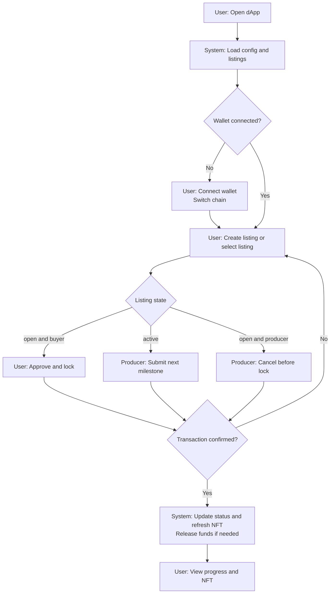
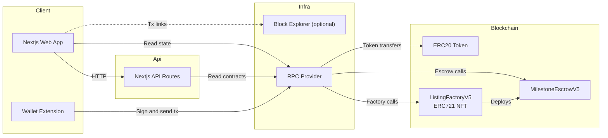

# Wagyu Milestone Escrow

[](./README.md)
[](./README.en.md)


A milestone-based escrow dApp for wagyu, sake, and craft listings.
Each listing deploys its own escrow contract and mints an ERC721 NFT that transfers on buyer lock.
Progress is released in milestones and rendered as a dynamic NFT (with pre-lock cancellation).

## Features

- `ListingFactoryV5` deploys `MilestoneEscrowV5` per listing and mints the NFT
- Buyers lock ERC20 and the status transitions `open → active → completed/cancelled`
- Producers can cancel listings only before lock (NFT is burned by the factory)
- Dynamic NFT metadata + SVG image API (`/api/nft/:tokenId`)
- Japanese/English UI with MetaMask chain switching (frontend-first, no DB)

## Requirements

- Node.js (compatible with Next.js 15)
- pnpm
- EVM wallet (MetaMask, etc.)
- RPC endpoint (supported: Sepolia 11155111 / Base Sepolia 84532 / Base 8453 / Polygon Amoy 80002)
- Deployed ListingFactoryV5 (ERC721) and ERC20 token addresses
- Solidity 0.8.24 / Foundry (if you build contracts)

## Installation

```bash
cd apps/web
pnpm install
```

## Quick Start

1. Go to `apps/web`
2. Copy `.env.example` to `.env.local`
3. Set RPC URL, Chain ID, and Factory/Token addresses
4. Run `pnpm dev`
5. Open `http://localhost:3000`

## Usage

### dApps

1. Producer connects a wallet and creates a listing (category, title, price, image URL)
2. Buyer purchases the listing (ERC20 approve → lock, two transactions)
3. Producer submits milestones in order and funds are released step-by-step
4. Producer can cancel before lock (`cancel()`)

Note: `lock()` cannot be called by the producer. Cancellation is only allowed before lock.

### Dynamic NFT API

- Metadata: `GET /api/nft/:tokenId`
- Image: `GET /api/nft/:tokenId/image`

The API resolves escrows via `ListingFactoryV5.tokenIdToEscrow`.
Set `ListingFactoryV5.baseURI` to your dApp origin so `tokenURI` points to `/api/nft/:tokenId`.

### Smart Contract Deployment (Example: Remix / Foundry)

1. Deploy `contracts/MockERC20.sol` (for testing)
2. Deploy `ListingFactoryV5` from `contracts/ListingFactoryV5.sol`
   - `tokenAddress`: ERC20 token address
   - `uri`: dApp origin (e.g., `https://your-app`)
3. Create listings from the dApp (`MilestoneEscrowV5` is deployed automatically and the NFT is minted)

## User Flow (Mermaid)



## System Architecture (Mermaid)



## Directory Structure

```
hackson/
├── apps/
│   └── web/                   # Next.js dApp
│       ├── src/app/            # App Router UI + API routes
│       ├── src/components/     # UI components
│       ├── src/lib/            # viem hooks + config + i18n + ABI
│       ├── .env.example        # Environment template
│       └── package.json
├── contracts/                  # Solidity smart contracts
│   ├── ListingFactoryV5.sol    # Factory + MilestoneEscrowV5
│   └── MockERC20.sol           # Test ERC20
├── lib/                         # OpenZeppelin contracts (submodule)
├── foundry.toml
├── README.md
├── README.en.md
└── LICENSE
```

## Configuration

`apps/web/.env.local`

```
NEXT_PUBLIC_RPC_URL=
NEXT_PUBLIC_CHAIN_ID=11155111
NEXT_PUBLIC_FACTORY_ADDRESS=
NEXT_PUBLIC_TOKEN_ADDRESS=
NEXT_PUBLIC_BLOCK_EXPLORER_TX_BASE=

# Optional (server-side override)
CHAIN_ID=

# Optional (legacy, not used by current UI)
NEXT_PUBLIC_CONTRACT_ADDRESS=
```

- `NEXT_PUBLIC_RPC_URL`: RPC URL for the target network
- `NEXT_PUBLIC_CHAIN_ID`: Chain ID (supported: Sepolia 11155111 / Base Sepolia 84532 / Base 8453 / Polygon Amoy 80002)
- `NEXT_PUBLIC_FACTORY_ADDRESS`: ListingFactoryV5 address
- `NEXT_PUBLIC_TOKEN_ADDRESS`: ERC20 token address
- `NEXT_PUBLIC_BLOCK_EXPLORER_TX_BASE`: Base URL for tx links (optional)
- `CHAIN_ID`: Chain ID override for API routes (optional)
- `NEXT_PUBLIC_CONTRACT_ADDRESS`: Legacy variable (not used in the current UI)

## Development

```bash
cd apps/web
pnpm dev
pnpm dev:turbo
pnpm build
pnpm start
pnpm lint
```

## License

MIT License. See `LICENSE`.
