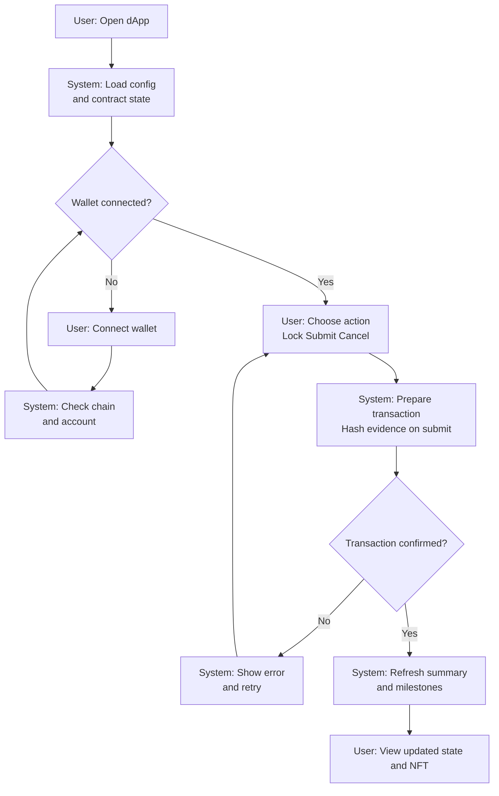

# Wagyu Milestone Escrow MVP

[](./README.md)
[](./README.en.md)


A B2B escrow dApp that models wagyu fattening steps as milestones.
Producers submit completion to auto-release ERC20 payments, and the state is visualized as a dynamic NFT.
Unaudited testnet MVP and not an investment product.

## Features

- Staged escrow based on 11 milestones (E1 to E6, E3_01 to E3_06)
- Fixed-role actions for Buyer/Producer/Admin (Lock, Submit, Cancel)
- Evidence text stored on-chain with hashing and events on submit
- Dynamic NFT metadata and SVG image API reflecting escrow status
- Frontend-only architecture with Next.js, viem, and Tailwind

## Requirements

- Node.js (compatible with Next.js 15)
- pnpm
- EVM wallet (MetaMask, etc.)
- RPC endpoint
- Deployed ERC20 token and MilestoneEscrow contract
- (Optional) MilestoneNFT contract for NFT-to-escrow resolution
- Solidity 0.8.24 (for contract compilation)

## Installation

```bash
cd apps/web
pnpm install
```

## Quick Start

1. Go to `apps/web`
2. Copy `.env.example` to `.env.local`
3. Set RPC URL, Chain ID, and contract addresses
4. Run `pnpm dev`
5. Open `http://localhost:3000`

## Usage

### dApp

1. Connect a wallet and switch to the target network
2. Buyer clicks “Lock Funds” (ERC20 approve → lock, two transactions)
3. Producer selects a milestone and submits evidence text (auto payment)
4. Buyer or Admin can cancel and refund remaining funds if needed

Note: `submit` requires `lock` to be completed first. `cancel` can be executed by Buyer or Admin at any time (no further actions after cancellation).

### Dynamic NFT API (Optional)

- Metadata: `GET /api/nft/:tokenId`
- Image: `GET /api/nft/:tokenId/image`

If `NEXT_PUBLIC_NFT_CONTRACT_ADDRESS` is set, the API resolves the escrow
address via `escrowContracts(tokenId)`. Otherwise it uses
`NEXT_PUBLIC_CONTRACT_ADDRESS`.

Set MilestoneNFT `baseURI` to your dApp origin (e.g., `https://your-app`).

### Smart Contract Deployment (Example: Remix)

1. Paste `contracts/MilestoneEscrow.sol` / `contracts/MockERC20.sol` / `contracts/MilestoneNFT.sol` into Remix
2. Compile with Solidity 0.8.24
3. Deploy `MockERC20` (example: `("Test Token", "TEST", 18)`)
4. Deploy `MilestoneEscrow`
   - `_token`: ERC20 token address
   - `_buyer`: Buyer address
   - `_producer`: Producer address
   - `_admin`: Admin address
   - `_totalAmount`: Total amount (smallest unit)
5. (Optional) Deploy `MilestoneNFT` and set `baseURI` to the dApp origin

## User Flow (Mermaid)



## System Architecture (Mermaid)

```mermaid
graph LR
  subgraph Client
    UI[Nextjs Web App]
    Wallet[Wallet Extension]
  end
  subgraph ApiServer
    API[Nextjs API Routes]
  end
  subgraph Infrastructure
    RPC[RPC Provider]
    Explorer[Block Explorer (optional)]
  end
  subgraph Blockchain
    Escrow[Milestone Escrow]
    Token[ERC20 Token]
    NFT[Milestone NFT (optional)]
  end
  UI -->|Read state| RPC
  Wallet -->|Sign and send tx| RPC
  API -->|Read state for metadata| RPC
  UI -->|Fetch NFT metadata and image| API
  RPC -->|Contract calls| Escrow
  RPC -->|Token calls| Token
  RPC -.->|Escrow lookup| NFT
  UI -.->|Tx links| Explorer
```

## Directory Structure

```
hackson/
├── apps/
│   └── web/                 # Next.js dApp
│       ├── src/app/          # App Router UI + API routes
│       ├── src/components/   # UI components
│       ├── src/lib/          # viem hooks + config
│       ├── .env.example      # Environment template
│       └── package.json
├── contracts/                # Solidity smart contracts
│   ├── MilestoneEscrow.sol
│   ├── MilestoneNFT.sol
│   └── MockERC20.sol
├── lib/                       # OpenZeppelin contracts
├── foundry.toml
├── README.md
├── README.en.md
└── LICENSE
```

## Configuration

`apps/web/.env.local`

```
NEXT_PUBLIC_RPC_URL=
NEXT_PUBLIC_CHAIN_ID=11155111
NEXT_PUBLIC_CONTRACT_ADDRESS=
NEXT_PUBLIC_TOKEN_ADDRESS=
NEXT_PUBLIC_BLOCK_EXPLORER_TX_BASE=

# Optional
NEXT_PUBLIC_NFT_CONTRACT_ADDRESS=
CHAIN_ID=
```

- `NEXT_PUBLIC_RPC_URL`: RPC URL for the target network
- `NEXT_PUBLIC_CHAIN_ID`: Chain ID (supported: Sepolia 11155111 / Base Sepolia 84532 / Base 8453 / Polygon Amoy 80002)
- `NEXT_PUBLIC_CONTRACT_ADDRESS`: MilestoneEscrow address
- `NEXT_PUBLIC_TOKEN_ADDRESS`: ERC20 token address
- `NEXT_PUBLIC_BLOCK_EXPLORER_TX_BASE`: Base URL for tx links (optional)
- `NEXT_PUBLIC_NFT_CONTRACT_ADDRESS`: MilestoneNFT address (optional)
- `CHAIN_ID`: Override Chain ID for API routes (optional)

## Development

```bash
cd apps/web
pnpm dev
pnpm dev:turbo
pnpm build
pnpm start
pnpm lint
```

## License

MIT License. See `LICENSE`.
