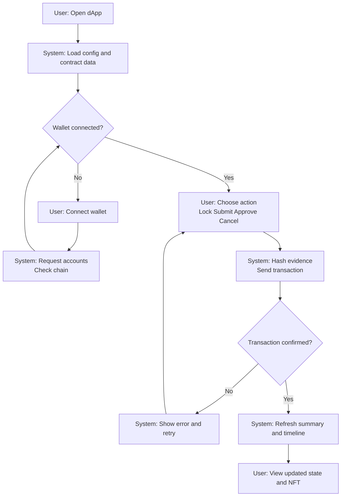
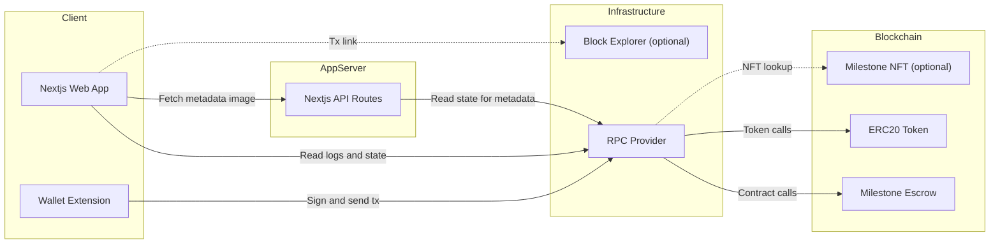

# Wagyu Milestone Escrow MVP

[](./README.md)
[](./README.en.md)


A B2B escrow dApp that models wagyu fattening steps as milestones and releases funds in stages
across three roles (Buyer/Producer/Admin). Evidence is stored on-chain and hashed, and the UI
builds a timeline plus a dynamic NFT view from on-chain events. This is an unaudited testnet MVP
and not an investment product.

## Features

- Staged escrow based on 11 milestones (E1 to E6)
- Role-based actions: Lock, Submit, Approve, Cancel
- On-chain evidence text with hashing and event timeline visualization
- Dynamic NFT metadata/image API that reflects escrow state
- Frontend-only architecture with Next.js, viem, and Tailwind

## Requirements

- Node.js (Next.js 15 project)
- pnpm
- EVM wallet such as MetaMask
- RPC endpoint
- Deployed ERC20 token and MilestoneEscrow contract
- (Optional) MilestoneNFT contract for NFT-to-escrow resolution

## Installation

```bash
cd apps/web
pnpm install
```

## Quick Start

1. Go to `apps/web`
2. Copy `.env.example` to `.env.local`
3. Set RPC URL, Chain ID, and contract addresses
4. Run `pnpm dev`
5. Open `http://localhost:3000`

## Usage

### dApp

1. Connect a wallet and switch to the target network
2. Buyer locks the total amount via "Lock Funds" (ERC20 approve required first)
3. Producer selects a milestone and submits evidence (stored on-chain and hashed)
4. Buyer approves and releases the milestone amount
5. Admin can cancel and refund remaining funds if needed

### Dynamic NFT API (Optional)

- Metadata: `GET /api/nft/:tokenId`
- Image: `GET /api/nft/:tokenId/image`

If `NEXT_PUBLIC_NFT_CONTRACT_ADDRESS` is set, the API resolves the escrow address
from the NFT contract. Otherwise it uses `NEXT_PUBLIC_CONTRACT_ADDRESS`.

### Smart Contract Deployment (Example: Remix)

1. Open https://remix.ethereum.org
2. Create and paste `contracts/MilestoneEscrow.sol` / `contracts/MockERC20.sol` / `contracts/MilestoneNFT.sol`
3. Compile with Solidity 0.8.24
4. Deploy `MockERC20` (example: `("Test Token", "TEST", 18)`)
5. Deploy `MilestoneEscrow`
   - `_token`: ERC20 token address
   - `_buyer`: Buyer address
   - `_producer`: Producer address
   - `_admin`: Admin address
   - `_totalAmount`: Total amount (smallest unit)
6. (Optional) Deploy `MilestoneNFT` and set `baseURI` to your dApp URL

## User Flow (Mermaid)



## System Architecture 



## Directory Structure

```
hackson/
├── apps/
│   └── web/                 # Next.js dApp
│       ├── src/app/          # App router UI + API routes
│       ├── src/components/   # UI components
│       ├── src/lib/          # viem hooks + config
│       ├── .env.example      # Environment template
│       └── package.json
├── contracts/                # Solidity smart contracts
│   ├── MilestoneEscrow.sol
│   ├── MilestoneNFT.sol
│   └── MockERC20.sol
├── lib/                       # OpenZeppelin contracts
├── foundry.toml
├── README.md
├── README.en.md
└── LICENSE
```

## Configuration

`apps/web/.env.local`

```
NEXT_PUBLIC_RPC_URL=
NEXT_PUBLIC_CHAIN_ID=11155111
NEXT_PUBLIC_CONTRACT_ADDRESS=
NEXT_PUBLIC_TOKEN_ADDRESS=
NEXT_PUBLIC_BLOCK_EXPLORER_TX_BASE=
NEXT_PUBLIC_NFT_CONTRACT_ADDRESS=
```

- `NEXT_PUBLIC_RPC_URL`: RPC URL for the target network
- `NEXT_PUBLIC_CHAIN_ID`: Chain ID (e.g., Sepolia 11155111 / Base Sepolia 84532 / Base 8453 / Polygon Amoy 80002)
- `NEXT_PUBLIC_CONTRACT_ADDRESS`: MilestoneEscrow address
- `NEXT_PUBLIC_TOKEN_ADDRESS`: ERC20 token address
- `NEXT_PUBLIC_BLOCK_EXPLORER_TX_BASE`: Base URL for tx links (optional)
- `NEXT_PUBLIC_NFT_CONTRACT_ADDRESS`: MilestoneNFT address (optional)

## Development

```bash
cd apps/web
pnpm dev
pnpm dev:turbo
pnpm build
pnpm start
pnpm lint
```

## License

MIT License. See `LICENSE`.
