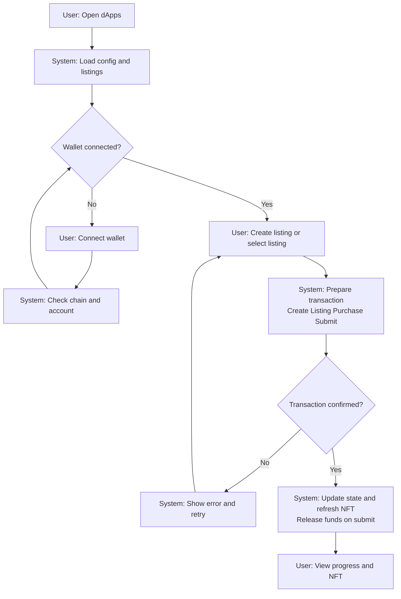

# Wagyu Milestone Escrow MVP

[](./README.md)
[](./README.en.md)


A milestone-based escrow dApp for wagyu, sake, and craft listings.
Each listing deploys its own escrow contract and mints an NFT that transfers to the buyer on lock.
Progress is released in milestones and rendered as a dynamic NFT.

## Features

- `ListingFactoryV3` deploys an escrow per listing and mints the ERC721 NFT
- Buyers lock ERC20 funds and receive the NFT (OPEN → ACTIVE → COMPLETED)
- Category-based milestones (wagyu 11 / sake 5 / craft 4) with fixed release rates
- Dynamic NFT metadata and SVG image API at `/api/nft/:tokenId`
- Frontend-only architecture with Next.js, viem, MUI, and Framer Motion

## Requirements

- Node.js (compatible with Next.js 15)
- pnpm
- EVM wallet (MetaMask, etc.)
- RPC endpoint (supported: Sepolia 11155111 / Base Sepolia 84532 / Base 8453 / Polygon Amoy 80002)
- Deployed ListingFactoryV3 (ERC721) and ERC20 token addresses
- Solidity 0.8.24 / Foundry (if you build contracts)

## Installation

```bash
cd apps/web
pnpm install
```

## Quick Start

1. Go to `apps/web`
2. Copy `.env.example` to `.env.local`
3. Set RPC URL, Chain ID, and Factory/Token addresses
4. Run `pnpm dev`
5. Open `http://localhost:3000`

## Usage

### dApps

1. Producer connects a wallet and creates a listing (category, title, price, image URL)
2. Buyer purchases the listing (ERC20 approve → lock, two transactions)
3. Producer submits milestones and ERC20 is released per step
4. Once all steps are completed, status becomes `completed` and the NFT reflects progress

Note: `lock()` cannot be called by the producer. There is no cancel flow in the current contracts.

### Dynamic NFT API

- Metadata: `GET /api/nft/:tokenId`
- Image: `GET /api/nft/:tokenId/image`

The API resolves escrows via `ListingFactoryV3.tokenIdToEscrow`.
Set `ListingFactoryV3.baseURI` to your dApp origin so `tokenURI` points to `/api/nft/:tokenId`.

### Smart Contract Deployment (Example: Remix / Foundry)

1. Deploy `contracts/MockERC20.sol` (for testing)
2. Deploy `ListingFactoryV3` from `contracts/ListingFactoryFull.sol`
   - `tokenAddress`: ERC20 token address
   - `uri`: dApp origin (e.g., `https://your-app`)
3. Create listings from the dApp (`MilestoneEscrowV3` is deployed automatically and NFT is minted)

## User Flow (Mermaid)



## System Architecture (Mermaid)


## Directory Structure

```
hackson/
├── apps/
│   └── web/                 # Next.js dApp
│       ├── src/app/          # App Router UI + API routes
│       ├── src/components/   # UI components
│       ├── src/lib/          # viem hooks + config
│       ├── .env.example      # Environment template
│       └── package.json
├── contracts/                # Solidity smart contracts
│   ├── ListingFactoryFull.sol # ListingFactoryV3 + MilestoneEscrowV3
│   └── MockERC20.sol          # Test ERC20
├── lib/                       # OpenZeppelin contracts (submodule)
├── foundry.toml
├── README.md
├── README.en.md
└── LICENSE
```

## Configuration

`apps/web/.env.local`

```
NEXT_PUBLIC_RPC_URL=
NEXT_PUBLIC_CHAIN_ID=11155111
NEXT_PUBLIC_FACTORY_ADDRESS=
NEXT_PUBLIC_TOKEN_ADDRESS=
NEXT_PUBLIC_BLOCK_EXPLORER_TX_BASE=

# Optional (server-side override)
CHAIN_ID=
```

- `NEXT_PUBLIC_RPC_URL`: RPC URL for the target network
- `NEXT_PUBLIC_CHAIN_ID`: Chain ID (supported: Sepolia 11155111 / Base Sepolia 84532 / Base 8453 / Polygon Amoy 80002)
- `NEXT_PUBLIC_FACTORY_ADDRESS`: ListingFactoryV3 address
- `NEXT_PUBLIC_TOKEN_ADDRESS`: ERC20 token address
- `NEXT_PUBLIC_BLOCK_EXPLORER_TX_BASE`: Base URL for tx links (optional)
- `CHAIN_ID`: Chain ID override for API routes (optional)

## Development

```bash
cd apps/web
pnpm dev
pnpm dev:turbo
pnpm build
pnpm start
pnpm lint
```

## License

MIT License. See `LICENSE`.
