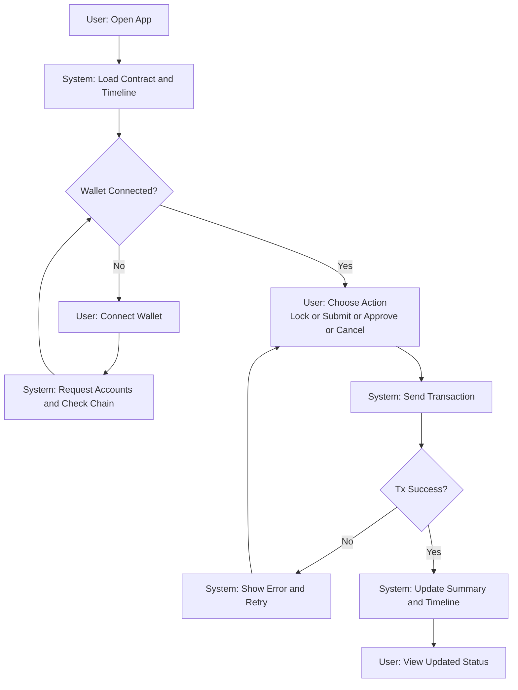
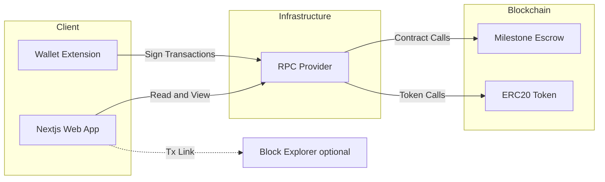

# Wagyu Milestone Escrow MVP

[](./README.md)
[](./README.en.md)


A milestone-based escrow dApp for wagyu fattening workflows.
Funds are released step-by-step by Buyer/Producer/Admin roles on testnet, with evidence hashed on-chain.

## Features

- 11 milestone escrow (E1 to E6) with staged releases
- Role-based actions: Lock, Submit, Approve, Cancel
- Evidence hashing and event timeline visualization
- Testnet support for Sepolia, Base Sepolia, and Polygon Amoy

## Requirements

- Node.js 18.17+ (compatible with Next.js 15)
- pnpm
- EVM wallet such as MetaMask
- RPC endpoint (Alchemy, etc.)
- Deployed ERC20 token and MilestoneEscrow contract

## Installation

```bash
cd apps/web
pnpm install
```

## Quick Start

1. Go to `apps/web`
2. Copy `.env.example` to `.env.local`
3. Set environment variables (RPC URL, Chain ID, contract addresses)
4. Run `pnpm dev`
5. Open `http://localhost:3000`

## Usage

### dApp

1. Connect MetaMask and switch to the target network
2. Buyer locks the total amount (ERC20 approve required first)
3. Producer submits a milestone with evidence
4. Buyer approves and releases the milestone amount
5. Admin can cancel and refund if needed

### Milestone Schedule

| Code | Description | Release Rate |
|------|-------------|--------------|
| E1 | Contract and cattle registration | 10% |
| E2 | Initial quarantine and onboarding | 10% |
| E3_01 to E3_06 | Monthly fattening logs x6 | 5% each (30% total) |
| E4 | Pre-shipment preparation | 10% |
| E5 | Shipment | 20% |
| E6 | Receipt and inspection | 20% |
| **Total** | | **100%** |

### Smart Contract Deployment (Remix)

1. Open https://remix.ethereum.org
2. Create and paste `contracts/MilestoneEscrow.sol` and `contracts/MockERC20.sol`
3. Compile with Solidity 0.8.20+
4. Deploy `MockERC20` (example: `("Test Token", "TEST", 18)`)
5. Deploy `MilestoneEscrow`
   - `_token`: ERC20 token address
   - `_buyer`: Buyer address
   - `_producer`: Producer address
   - `_admin`: Admin address
   - `_totalAmount`: Total amount (smallest unit)

## Important Notes

- This is B2B payment infrastructure, not an investment product
- Contracts are not audited; use testnet only
- Do not use with real funds

## User Flow (Mermaid)



## System Architecture (Mermaid)



## Directory Structure

```
hackson/
├── apps/
│   └── web/                # Next.js dApp
│       ├── src/app/         # App router UI
│       ├── src/components/  # UI components
│       └── src/lib/         # viem + hooks + config
├── contracts/               # Solidity smart contracts
│   ├── MilestoneEscrow.sol
│   └── MockERC20.sol
├── idea.md
├── plan.md
├── README.md
├── README.en.md
└── LICENSE
```

## Configuration

`apps/web/.env.local`

```
NEXT_PUBLIC_RPC_URL=
NEXT_PUBLIC_CHAIN_ID=11155111
NEXT_PUBLIC_CONTRACT_ADDRESS=
NEXT_PUBLIC_TOKEN_ADDRESS=
NEXT_PUBLIC_BLOCK_EXPLORER_TX_BASE=
```

- `NEXT_PUBLIC_RPC_URL`: RPC URL for the target network
- `NEXT_PUBLIC_CHAIN_ID`: Chain ID (e.g., Sepolia 11155111)
- `NEXT_PUBLIC_CONTRACT_ADDRESS`: MilestoneEscrow address
- `NEXT_PUBLIC_TOKEN_ADDRESS`: ERC20 token address
- `NEXT_PUBLIC_BLOCK_EXPLORER_TX_BASE`: Base URL for tx links (optional)

## Development

```bash
cd apps/web
pnpm dev
pnpm build
pnpm start
pnpm lint
```

## License

MIT License. See `LICENSE`.
