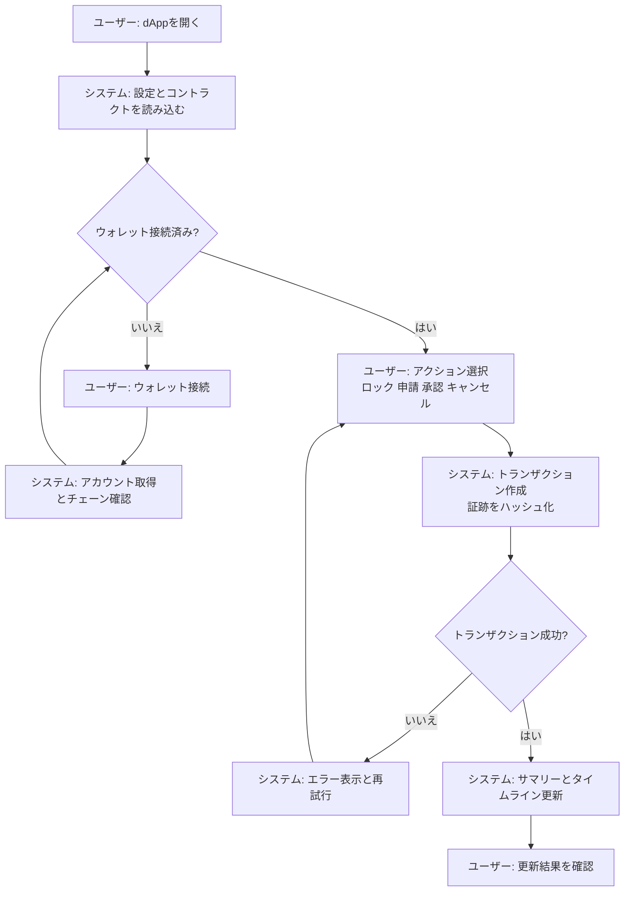
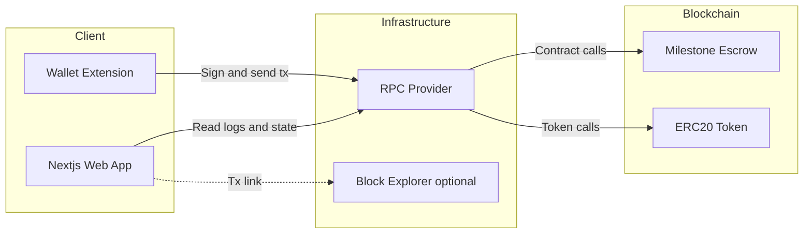

# Wagyu Milestone Escrow MVP

[](./README.md)
[](./README.en.md)


和牛の肥育工程をマイルストーンとして定義し、Buyer/Producer/Admin の3ロールで資金を段階解放する
B2B向けエスクローdAppです。証跡はハッシュ化してオンチェーンに保存し、イベントからタイムラインを表示します。
これはB2B決済インフラであり投資商品ではありません。未監査のデモ/テストネット向けMVPです。

## Features

- 11マイルストーン（E1〜E6）に基づく段階支払いエスクロー
- Buyer/Producer/Adminのロール別アクション（Lock, Submit, Approve, Cancel）
- 証跡入力のハッシュ化とイベントタイムラインの可視化
- Sepolia / Base Sepolia / Polygon Amoy テストネット対応
- Next.js + viem + Tailwindによるフロントエンド（バックエンド不要）

## Requirements

- Node.js（Next.js 15互換）
- pnpm
- MetaMaskなどのEVMウォレット
- RPCエンドポイント
- デプロイ済みのERC20トークンとMilestoneEscrowコントラクト

## Installation

```bash
cd apps/web
pnpm install
```

## Quick Start

1. `apps/web` に移動
2. `.env.example` を `.env.local` にコピー
3. RPC URL、Chain ID、コントラクトアドレスを設定
4. `pnpm dev` を実行
5. `http://localhost:3000` を開く

## Usage

### dApp

1. ウォレットを接続し、対象ネットワークへ切り替え
2. Buyerが「Lock Funds」で総額をロック（事前にERC20 approveが必要）
3. Producerがマイルストーンを選択し、証跡を入力してSubmit（証跡はハッシュ化）
4. Buyerが承認し、該当分の資金を解放
5. Adminは必要に応じてCancelで未解放分を返金

### Milestone Schedule

| Code | Description | Release Rate |
|------|-------------|--------------|
| E1 | 契約・個体登録 | 10% |
| E2 | 初期検疫・導入 | 10% |
| E3_01〜E3_06 | 月次肥育記録×6 | 5% each (30% total) |
| E4 | 出荷準備 | 10% |
| E5 | 出荷 | 20% |
| E6 | 受領・検収 | 20% |
| **Total** | | **100%** |

### Smart Contract Deployment (Example: Remix)

1. https://remix.ethereum.org を開く
2. `contracts/MilestoneEscrow.sol` と `contracts/MockERC20.sol` を作成して貼り付け
3. Solidity 0.8.20+ でコンパイル
4. `MockERC20` をデプロイ（例: `("Test Token", "TEST", 18)`）
5. `MilestoneEscrow` をデプロイ
   - `_token`: ERC20トークンアドレス
   - `_buyer`: Buyerアドレス
   - `_producer`: Producerアドレス
   - `_admin`: Adminアドレス
   - `_totalAmount`: 総額（最小単位）

## User Flow (Mermaid)



## System Architecture (Mermaid)



## Directory Structure

```
hackson/
├── apps/
│   └── web/                 # Next.js dApp
│       ├── src/app/          # App router UI
│       ├── src/components/   # UI components
│       ├── src/lib/          # viem hooks + config
│       ├── .env.example      # 環境変数テンプレート
│       └── package.json
├── contracts/                # Solidity smart contracts
│   ├── MilestoneEscrow.sol
│   └── MockERC20.sol
├── README.md
├── README.en.md
└── LICENSE
```

## Configuration

`apps/web/.env.local`

```
NEXT_PUBLIC_RPC_URL=
NEXT_PUBLIC_CHAIN_ID=11155111
NEXT_PUBLIC_CONTRACT_ADDRESS=
NEXT_PUBLIC_TOKEN_ADDRESS=
NEXT_PUBLIC_BLOCK_EXPLORER_TX_BASE=
```

- `NEXT_PUBLIC_RPC_URL`: 対象ネットワークのRPC URL
- `NEXT_PUBLIC_CHAIN_ID`: Chain ID（例: Sepolia 11155111 / Base Sepolia 84532 / Polygon Amoy 80002）
- `NEXT_PUBLIC_CONTRACT_ADDRESS`: MilestoneEscrowのアドレス
- `NEXT_PUBLIC_TOKEN_ADDRESS`: ERC20トークンのアドレス
- `NEXT_PUBLIC_BLOCK_EXPLORER_TX_BASE`: 取引URLのベース（任意）

## Development

```bash
cd apps/web
pnpm dev
pnpm build
pnpm start
pnpm lint
```

## License

MIT License. See `LICENSE`.
