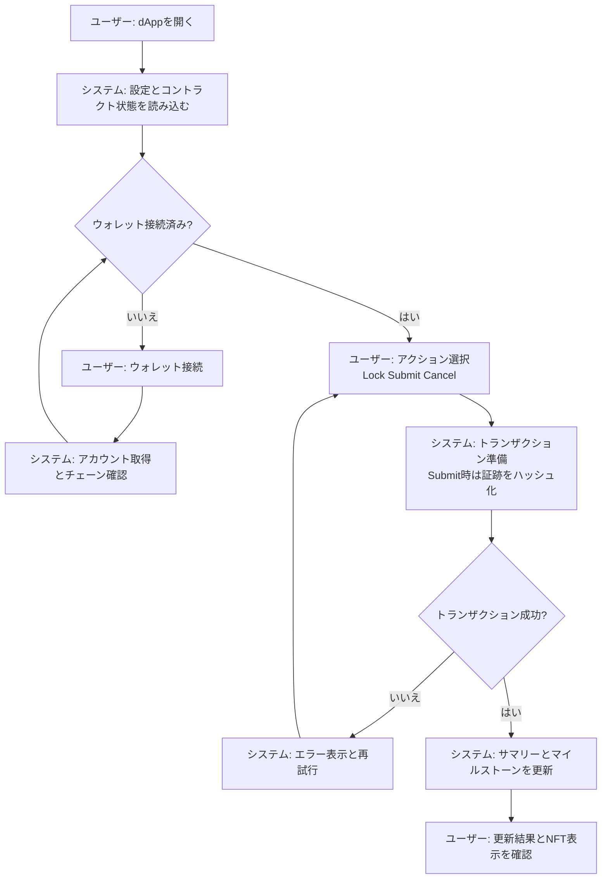

# Wagyu Milestone Escrow MVP

[](./README.md)
[](./README.en.md)


和牛肥育工程をマイルストーン化したB2B向けエスクローdAppです。
Producerの工程完了申請でERC20が自動解放され、状態はDynamic NFTとして可視化されます。
監査未実施のテストネットMVPであり、投資商品ではありません。

## Features

- 11マイルストーン（E1〜E6、E3_01〜E3_06）に基づく段階解放
- Buyer/Producer/Adminのロール固定アクション（Lock, Submit, Cancel）
- Submit時に証跡テキストをオンチェーン保存し、ハッシュ化してイベント発行
- Dynamic NFTメタデータ/SVG画像API（エスクロー状態を反映）
- Next.js + viem + Tailwindによるフロントエンド（DB/サーバー不要）

## Requirements

- Node.js（Next.js 15互換）
- pnpm
- EVMウォレット（MetaMaskなど）
- RPCエンドポイント
- デプロイ済みのERC20トークンとMilestoneEscrowコントラクト
- （任意）MilestoneNFTコントラクト（NFTからエスクローを解決する場合）
- Solidity 0.8.24（コントラクトコンパイル時）

## Installation

```bash
cd apps/web
pnpm install
```

## Quick Start

1. `apps/web` に移動
2. `.env.example` を `.env.local` にコピー
3. RPC URL、Chain ID、コントラクトアドレスを設定
4. `pnpm dev` を実行
5. `http://localhost:3000` を開く

## Usage

### dApp

1. ウォレットを接続し、対象ネットワークへ切り替え
2. Buyerが「Lock Funds」を実行（ERC20 approve → lock の2トランザクション）
3. Producerがマイルストーンを選択し、証跡テキストを入力してSubmit（自動支払い）
4. BuyerまたはAdminが必要に応じてCancelで未解放分を返金

※ `submit` は `lock` 完了後のみ実行できます。`cancel` はBuyerまたはAdminがいつでも実行できます（キャンセル後は進行不可）。

### Dynamic NFT API（任意）

- メタデータ: `GET /api/nft/:tokenId`
- 画像: `GET /api/nft/:tokenId/image`

`NEXT_PUBLIC_NFT_CONTRACT_ADDRESS` が設定されている場合は
NFTコントラクトの `escrowContracts(tokenId)` からエスクローを解決します。
未設定の場合は `NEXT_PUBLIC_CONTRACT_ADDRESS` を使用します。

MilestoneNFTの `baseURI` には dApp のオリジン（例: `https://your-app`）を設定してください。

### Smart Contract Deployment（Example: Remix）

1. Remixで `contracts/MilestoneEscrow.sol` / `contracts/MockERC20.sol` / `contracts/MilestoneNFT.sol` を貼り付け
2. Solidity 0.8.24 でコンパイル
3. `MockERC20` をデプロイ（例: `("Test Token", "TEST", 18)`）
4. `MilestoneEscrow` をデプロイ
   - `_token`: ERC20トークンアドレス
   - `_buyer`: Buyerアドレス
   - `_producer`: Producerアドレス
   - `_admin`: Adminアドレス
   - `_totalAmount`: 総額（最小単位）
5. （任意）`MilestoneNFT` をデプロイし、`baseURI` にdAppのオリジンを指定

## User Flow (Mermaid)



## System Architecture (Mermaid)

```mermaid
graph LR
  subgraph Client
    UI[Nextjs Web App]
    Wallet[Wallet Extension]
  end
  subgraph ApiServer
    API[Nextjs API Routes]
  end
  subgraph Infrastructure
    RPC[RPC Provider]
    Explorer[Block Explorer (optional)]
  end
  subgraph Blockchain
    Escrow[Milestone Escrow]
    Token[ERC20 Token]
    NFT[Milestone NFT (optional)]
  end
  UI -->|Read state| RPC
  Wallet -->|Sign and send tx| RPC
  API -->|Read state for metadata| RPC
  UI -->|Fetch NFT metadata and image| API
  RPC -->|Contract calls| Escrow
  RPC -->|Token calls| Token
  RPC -.->|Escrow lookup| NFT
  UI -.->|Tx links| Explorer
```

## Directory Structure

```
hackson/
├── apps/
│   └── web/                 # Next.js dApp
│       ├── src/app/          # App Router UI + API routes
│       ├── src/components/   # UI components
│       ├── src/lib/          # viem hooks + config
│       ├── .env.example      # 環境変数テンプレート
│       └── package.json
├── contracts/                # Solidity smart contracts
│   ├── MilestoneEscrow.sol
│   ├── MilestoneNFT.sol
│   └── MockERC20.sol
├── lib/                       # OpenZeppelin contracts
├── foundry.toml
├── README.md
├── README.en.md
└── LICENSE
```

## Configuration

`apps/web/.env.local`

```
NEXT_PUBLIC_RPC_URL=
NEXT_PUBLIC_CHAIN_ID=11155111
NEXT_PUBLIC_CONTRACT_ADDRESS=
NEXT_PUBLIC_TOKEN_ADDRESS=
NEXT_PUBLIC_BLOCK_EXPLORER_TX_BASE=

# Optional
NEXT_PUBLIC_NFT_CONTRACT_ADDRESS=
CHAIN_ID=
```

- `NEXT_PUBLIC_RPC_URL`: 対象ネットワークのRPC URL
- `NEXT_PUBLIC_CHAIN_ID`: Chain ID（対応: Sepolia 11155111 / Base Sepolia 84532 / Base 8453 / Polygon Amoy 80002）
- `NEXT_PUBLIC_CONTRACT_ADDRESS`: MilestoneEscrowのアドレス
- `NEXT_PUBLIC_TOKEN_ADDRESS`: ERC20トークンのアドレス
- `NEXT_PUBLIC_BLOCK_EXPLORER_TX_BASE`: 取引URLのベース（任意）
- `NEXT_PUBLIC_NFT_CONTRACT_ADDRESS`: MilestoneNFTのアドレス（任意）
- `CHAIN_ID`: APIルート用のChain ID上書き（任意）

## Development

```bash
cd apps/web
pnpm dev
pnpm dev:turbo
pnpm build
pnpm start
pnpm lint
```

## License

MIT License. See `LICENSE`.
