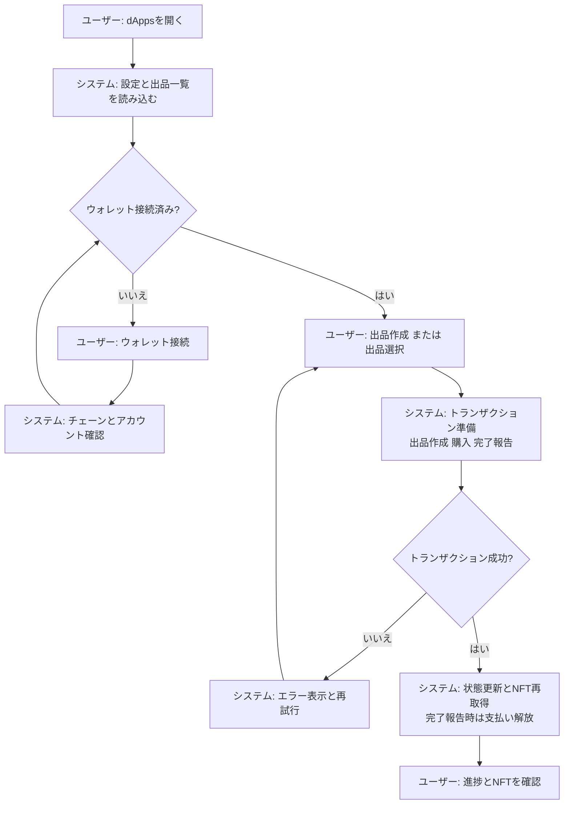

# Wagyu Milestone Escrow MVP

[](./README.md)
[](./README.en.md)


和牛・日本酒・工芸品の出品に対応した、マイルストーン型のエスクローdAppです。
出品ごとにエスクロー契約とNFTが生成され、購入者のロックと同時にNFTが移転します。
進捗はマイルストーンで段階解放され、Dynamic NFTとして可視化されます。

## Features

- 出品ごとに `ListingFactoryV3` がエスクローをデプロイし、NFT（ERC721）をミント
- 購入時にERC20をロックし、NFTは購入者へ移転（OPEN → ACTIVE → COMPLETED）
- カテゴリ別マイルストーン（wagyu 11 / sake 5 / craft 4）で段階解放
- Dynamic NFTメタデータ/SVG画像API（`/api/nft/:tokenId`）
- Next.js + viem + MUI + Framer Motionによるフロントエンド（DB/サーバー不要）

## Requirements

- Node.js（Next.js 15 互換）
- pnpm
- EVMウォレット（MetaMaskなど）
- RPCエンドポイント（対応: Sepolia 11155111 / Base Sepolia 84532 / Base 8453 / Polygon Amoy 80002）
- ListingFactoryV3（ERC721）とERC20トークンのデプロイ済みアドレス
- Solidity 0.8.24 / Foundry（コントラクトをビルドする場合）

## Installation

```bash
cd apps/web
pnpm install
```

## Quick Start

1. `apps/web` に移動
2. `.env.example` を `.env.local` にコピー
3. RPC URL、Chain ID、Factory/Tokenアドレスを設定
4. `pnpm dev` を実行
5. `http://localhost:3000` を開く

## Usage

### dApps

1. Producerがウォレット接続し、カテゴリ・タイトル・価格・画像URLを指定して出品
2. Buyerが出品を購入（ERC20 approve → lock の2トランザクション）
3. Producerがマイルストーンを完了報告すると、その分のERC20が解放
4. すべて完了すると `completed` になり、NFTが進捗を反映

※ `lock()` はProducer本人からは実行できません。キャンセル機能は実装されていません。

### Dynamic NFT API

- メタデータ: `GET /api/nft/:tokenId`
- 画像: `GET /api/nft/:tokenId/image`

APIは `ListingFactoryV3` の `tokenIdToEscrow` からエスクローを解決します。
`ListingFactoryV3` の `baseURI` は dApp のオリジンに設定してください（`/api/nft/:tokenId` を参照します）。

### Smart Contract Deployment（Example: Remix / Foundry）

1. `contracts/MockERC20.sol` をデプロイ（テスト用）
2. `contracts/ListingFactoryFull.sol` から `ListingFactoryV3` をデプロイ
   - `tokenAddress`: ERC20トークンアドレス
   - `uri`: dAppのオリジン（`https://your-app` など）
3. dApp から `createListing` を実行（`MilestoneEscrowV3` が自動デプロイされNFTがミント）

## User Flow (Mermaid)



## System Architecture (Mermaid)


## Directory Structure

```
hackson/
├── apps/
│   └── web/                 # Next.js dApp
│       ├── src/app/          # App Router UI + API routes
│       ├── src/components/   # UI components
│       ├── src/lib/          # viem hooks + config
│       ├── .env.example      # 環境変数テンプレート
│       └── package.json
├── contracts/                # Solidity smart contracts
│   ├── ListingFactoryFull.sol # ListingFactoryV3 + MilestoneEscrowV3
│   └── MockERC20.sol          # Test ERC20
├── lib/                       # OpenZeppelin contracts (submodule)
├── foundry.toml
├── README.md
├── README.en.md
└── LICENSE
```

## Configuration

`apps/web/.env.local`

```
NEXT_PUBLIC_RPC_URL=
NEXT_PUBLIC_CHAIN_ID=11155111
NEXT_PUBLIC_FACTORY_ADDRESS=
NEXT_PUBLIC_TOKEN_ADDRESS=
NEXT_PUBLIC_BLOCK_EXPLORER_TX_BASE=

# Optional (server-side override)
CHAIN_ID=
```

- `NEXT_PUBLIC_RPC_URL`: 対象ネットワークのRPC URL
- `NEXT_PUBLIC_CHAIN_ID`: Chain ID（対応: Sepolia 11155111 / Base Sepolia 84532 / Base 8453 / Polygon Amoy 80002）
- `NEXT_PUBLIC_FACTORY_ADDRESS`: ListingFactoryV3のアドレス
- `NEXT_PUBLIC_TOKEN_ADDRESS`: ERC20トークンのアドレス
- `NEXT_PUBLIC_BLOCK_EXPLORER_TX_BASE`: 取引URLのベース（任意）
- `CHAIN_ID`: APIルート用のChain ID上書き（任意）

## Development

```bash
cd apps/web
pnpm dev
pnpm dev:turbo
pnpm build
pnpm start
pnpm lint
```

## License

MIT License. See `LICENSE`.
